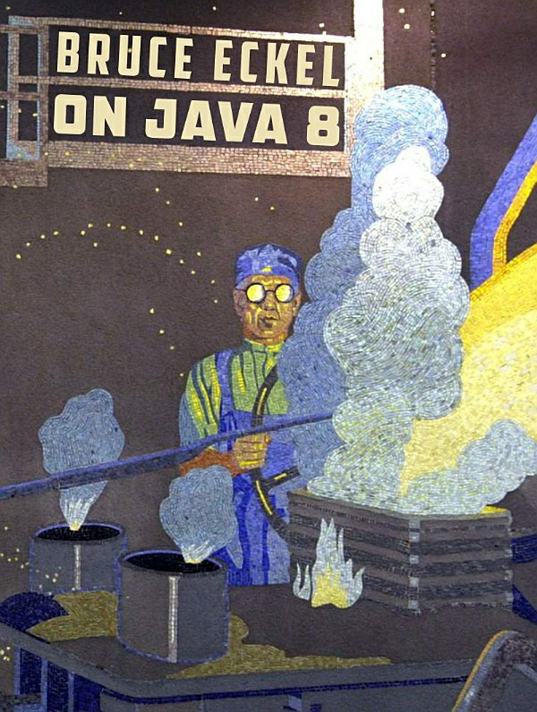

# OnJava8 中文

  

## 序

- 本书原作者为 [美] Bruce Eckel，即《Java 编程思想》的作者。
- 本书是事实上的 《Java 编程思想》第五版。
- 《Java 编程思想》第四版基于 JAVA 5 版本；《On Java 8》 基于 JAVA 8 版本。

## 目录

- [前言](前言.md)
- [简介](简介.md)

---

- [第 1 章 对象的概念](第%201%20章%20对象的概念.md)
- [第 2 章 安装 Java 和本书用例](第%202%20章%20安装%20Java%20和本书用例.md)
- [第 3 章 万物皆对象](第%203%20章%20万物皆对象.md)
- [第 4 章 运算符](第%204%20章%20运算符.md)
- [第 5 章 控制流](第%205%20章%20控制流.md)
- [第 6 章 初始化和清理](第%206%20章%20初始化和清理.md)
- [第 7 章 封装](第%207%20章%20封装.md)
- [第 8 章 复用](第%208%20章%20复用.md)
- [第 9 章 多态](第%209%20章%20多态.md)
- [第 10 章 接口](第%2010%20章%20接口.md)
- [第 11 章 内部类](第%2011%20章%20内部类.md)
- [第 12 章 集合](第%2012%20章%20集合.md)
- [第 13 章 函数式编程](第%2013%20章%20函数式编程.md)
- [第 14 章 流式编程](第%2014%20章%20流式编程.md)
- [第 15 章 异常](第%2015%20章%20异常.md)
- [第 16 章 代码校验](第%2016%20章%20代码校验.md)
- [第 17 章 文件](第%2017%20章%20文件.md)
- [第 18 章 字符串](第%2018%20章%20字符串.md)
- [第 19 章 类型信息](第%2019%20章%20类型信息.md)
- [第 20 章 泛型](第%2020%20章%20泛型.md)
- [第 21 章 数组](第%2021%20章%20数组.md)
- [第 22 章 枚举](第%2022%20章%20枚举.md)
- [第 23 章 注解](第%2023%20章%20注解.md)
- [第 24 章 并发编程](第%2024%20章%20并发编程.md)
- [第 25 章 设计模式](第%2025%20章%20设计模式.md)

---

- [附录:补充](appendices/app-supplements.md)
- [附录:编程指南](appendices/app-programming-guidelines.md)
- [附录:文档注释](appendices/app-javadoc.md)
- [附录:对象传递和返回](appendices/app-passing-and-returning-objects.md)
- [附录:流式 IO](appendices/app-io-streams.md)
- [附录:标准 IO](appendices/app-standard-io.md)
- [附录:新 IO](appendices/app-new-io.md)
- [附录:理解 equals 和 hashCode 方法](appendices/app-understanding-equals-and-hashcode.md)
- [附录:集合主题](appendices/app-collection-topics.md)
- [附录:并发底层原理](appendices/app-low-level-concurrency.md)
- [附录:数据压缩](appendices/app-data-compression.md)
- [附录:对象序列化](appendices/app-object-serialization.md)
- [附录:静态语言类型检查](appendices/app-benefits-and-costs-of-static-type-checking.md)
- [附录:C++和 Java 的优良传统](appendices/app-the-positive-legacy-of-c-plus-plus-and-java.md)
- [附录:成为一名程序员](appendices/app-becoming-a-programmer.md)
