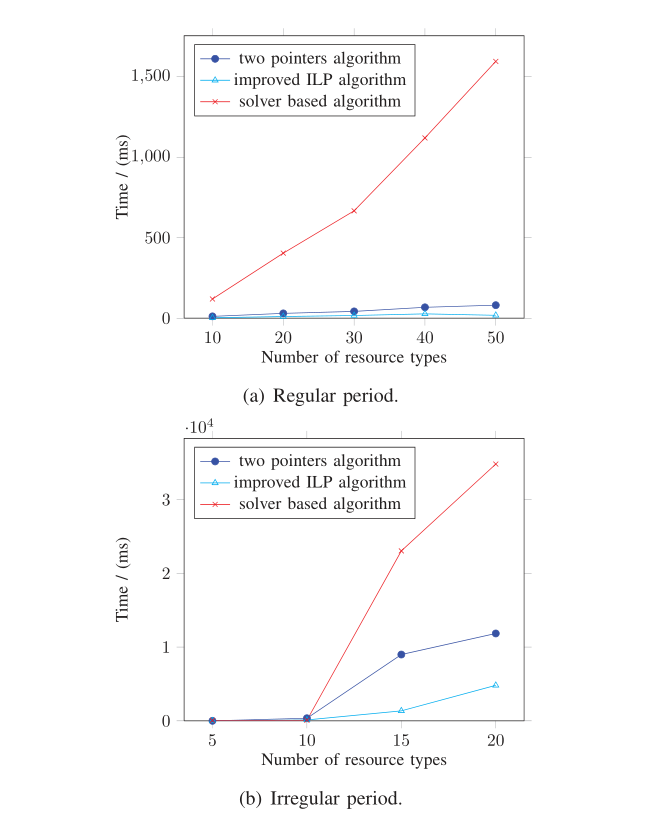
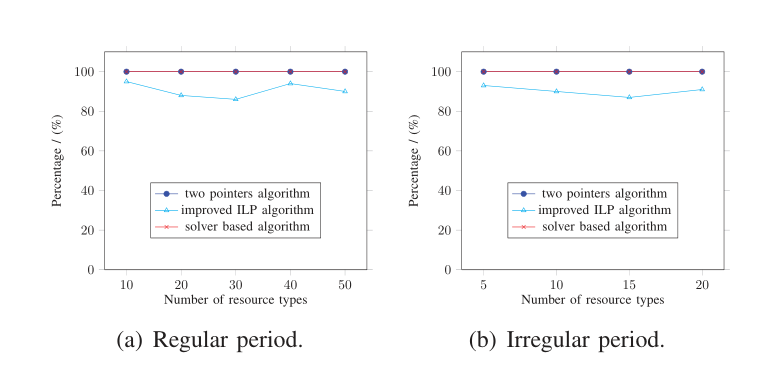
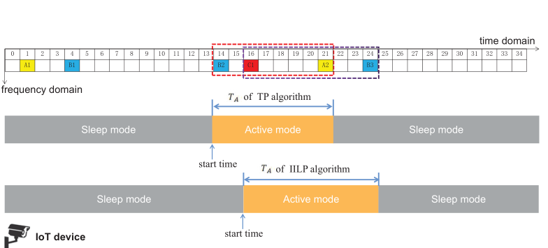

## 结果对比

我们通过仿真评估了 TP 算法、IILP 算法和基于 ILP 求解器的基本算法的性能。算法在不同参数设置下的比较  $period \; \in \; \{x|x = 10k, 1 \leq k \leq 10, k \in \Bbb z\} \enspace \cup \enspace [1, 100].$ $period \in [1,100]$ 可以作为LCM很大的不规则周期下的设置。 $period \; \in \; \{x|x = 10k, 1 \leq k \leq 10, k \in \Bbb z\}$ 是常规周期下的设置，其中周期的LCM相对较小。我们分别比较了实验结果，

这些结果以不同设置实例的运行时间和 OSR（最优解比）(Optimal Solutions Ratio) 表示。

**A. 实验设置**

所有实验均在配备 `Intel Core i7-9700 3.0 GHz` 处理器和 `16GB RAM` 的 PC 上进行。算法采用 `Java` 编码，

由 `Eclipse ID 2021-06 JDK16.0.2` 编译。有很多非常快速且可用的求解器可以解决 ILP 问题，

例如 `CPLEX`、`Gurobi` 和 `MATLAB`。在本文中，我们采用 `CPLEX` 求解器作为求解优化问题的比较方法。设置参数详见下表:	

-  资源数量（N）：$[1,50]$ 中的随机整数
-  每个资源的周期：定期或不定期
-  每个资源的占用时间：小于其周期的随机整数
-  以毫秒为单位的活动间隔范围的持续时间：$[1, 200]$
-  物联网设备数量：100
-  每个设备所需的资源：从AP的资源集中随机选择

此外，我们通过改变资源类型数量 N、资源周期和占用时间来检验三种算法的性能。

我们慢慢增加 N，观察这些算法分别在规则周期和非规则周期情况下的运行时间与 N 的关系。

**B. 算法比较**

TP算法、IILP算法和基于求解器的算法的效率比较结果如图4所示。从图（a）可以看出，TP算法和IILP算法的运行时间随着N和IILP缓慢上升算法性能略优于TP算法。所有常规周期的LCM都在一个恒定的范围内，所以耗时都在毫秒级别。然而，基于求解器的算法需要更多的时间来获得解决方案。图(b)是三种算法对不规则资源周期的处理效率。从图中可以看出，基于求解器的算法和TP算法的运行时间随着资源量的增加而大幅攀升。 IILP算法的运行时间也随着N的增加而增加，但相对较慢。由于所有资源的周期都是不规则的、随机的，当N超过20时，所有周期的LCM都非常高，导致出结果的时间变长。为了合理和适用，周期性资源模型应该应用规则周期而不是不规则周期。最后，我们发现周期较大的资源在搜索空间中出现的频率较低。因此，应优先处理周期较大的资源，以更快地得到解决方案.

图 5 展示了三种算法的 OSR。具体来说，图 5(a) 和图 5(b) 分别与规则周期和不规则周期相关联。

最佳解决方案代表这些算法的活动间隔持续时间较短。 OSR 可以通过 Eq. 10 计算。 其中 $u_{opt}$ 表示最优解的数量，$u_{total}$ 表示测试的总数。
$$
r_{opt} = \frac{u_{opt}}{u{total}} \times 100\% \tag{10}
$$
从图 （a）和图 （b）可以看出，对于这两种情况，TP 算法和基于求解器的算法都比 IILP 算法获得了更好的解决方案。原因在于TP算法需要更多的时间来遍历整个候选区间。因此，TP算法适用于周期性寻找最优解的情况，因为 $LCM$ 较小。此外，我们发现由于所有资源的首次占用时间都小于 100，因此最佳持续时间不会超过 100。

三种算法的性能由两个标准评估，即效率和有效性。上述讨论表明，IILP 算法在效率上统计上优于 TP 算法，这意味着 IILP 算法适用于实时应用。 TP算法在有效性上表现出较好的性能，适用于寻找最优解的周期性情况。因此，在实际场景中需要根据具体需求来决定选择哪种算法。

下图说明了上述示例中的两个建议算法找到的 $T_A$ 的最小持续时间。 TP算法的解是距离 $[14, 21]$ 区间 8ms，IILP算法的结果是 9ms。该示例的最终解决方案是 8ms。 TP算法求最优解。设备在时间 14 设置为活动模式，然后在时间 22 切换到睡眠模式。睡眠间隔的持续时间为 $T_S = LCM − T_A = 54$。设备在活动和睡眠模式之间反复切换。
