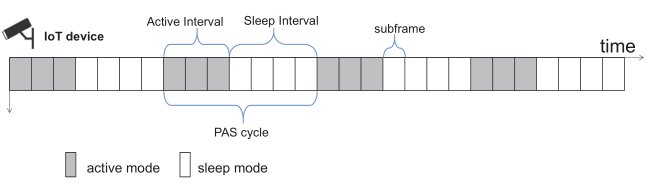

# 物联网设备的定期睡眠与激活

## 摘要

摘要：如何有效利用有限的电池容量对于物联网（IoT）设备至关重要。在许多应用中，没有必要让每个设备始终处于活动状态。换句话说，设备应该定期激活和休眠以减少能源消耗。在本文中，使用 ILP（整数线性规划）对正在研究的设备活动时间最小化问题进行了数学建模。在分析了变量的界限后，提出了IILP（改进的整数线性规划）算法来解决所考虑的多项式时间内的优化问题，但它不能保证获得最优解。此外，还开发了基于遍历的 TP（双指针）算法，以获得具有更长计算时间的最优解。通过在大量实例中将 IILP 与 TP 进行比较，实验结果表明 IILP 比 TP 快得多，而 TP 在有效性上优于 IILP。

关键词——周期性激活和睡眠机制；整数线性规划；物联网

## 介绍

在万物互联的时代，各种物联网应用产生了大量有价值的数据。需要处理大量数据的海量请求会导致网络中的巨大能源消耗。它一直是电信运营商用电量和运营支出的重要贡献者。因此，低能耗的需求对于最大限度地减少电信运营商的开支至关重要。

节省能源和保持可接受的服务质量的最有效方法之一是采用周期性资源模型(periodic
resource model) [1]、[2]。通常APs(Access Points)（接入点）的无线资源总是可用的，并且会消耗大量的能量。为了节约能源，APs 采用周期性资源模型，这意味着 APs 的资源不是持续可供设备使用的。相反，这些资源定期可供终端设备使用。

此外，物联网的快速发展离不开物联网设备（如传感器、智能移动设备、监控设备）的支持。物联网设备收集的海量数据通过 APs 转发到数据中心，并用于模式识别、监控、AR（增强现实）、VR（虚拟现实）等许多应用。大多数物联网设备由电池供电，并且这些设备的数量正在逐渐增长。因此，降低能耗是设备供应商的主要需求之一。设备可以将数据传输到可用的 APs 进行处理。物联网设备连接到 APs 后，APs 会为其分配必要的周期性资源。基于以上情况，我们在论文中采用了PAS（Periodic Activation and Sleep）机制。 IoT 设备可以休眠一段预定义的时间，然后返回到活动模式，而不是连续活动状态。设备周期性地而不是随机地向AP传输数据，以减少设备的活动持续时间和设备等待可用周期性资源的时间。

同样，IEEE（电气和电子工程师协会）802.11ac WiFi 标准 [3] 在空闲时间为终端设备定义了 PSM（省电模式），以最大限度地降低能耗。本文采用与物联网设备类似的PAS机制，使APs的周期性资源得到充分利用，物联网设备尽可能降低能耗。论文中考虑的问题是最小化设备的活动持续时间，同时确保设备在其活动状态期间可以使用所有必需的资源。最小化设备的活动时长可以提高AP的资源利用率，降低物联网设备的能耗。我们的工作主要研究物联网设备在为物联网设备分配多个周期性资源的背景下的活动和睡眠持续时间。

优化问题存在以下几个挑战。 1) 所有资源的 LCM（最小公倍数）周期可能非常大。查找包含所有必需资源的最小可用持续时间可能很耗时。但是，在实时应用中花费很长时间来解决问题是不可接受的。 2）没有理论研究证明这个问题是一个多项式问题。解决问题会很困难。

本文的主要贡献总结如下。
1.  我们制定了物联网设备活动时间最小化的优化问题。
2.  我们开发了解决优化问题的TP算法和IILP方法并获得了最优解。该算法适用于所考虑的具有随机资源周期的问题，这可能导致巨大的解空间。
3.  我们在多项式时间内解决了 ILP 问题。由于所有变量都是整数并且变量的范围是有界的，因此即使穷举搜索也可以得到优化问题的解。

我们在有效性和效率方面比较了 IILP 算法和 TP 算法的性能。实验结果表明，IILP算法在效率上表现更好，TP算法在有效性上表现更好。

本文的其余部分安排如下。第二节回顾了相关工作。第三节给出了系统模型和问题的表述。所提出的算法在第四节中描述。第五节给出了实验结果并进行了分析，并得出了第六节的结论。

## 相关工作

周期性资源的概念最早是在[4]中正式提出的，并受到了广泛的关注和深入研究[1]、[2]。金等人。 [1] 为实时系统引入了一种节能的周期性资源模型算法，以最大限度地减少能源使用。 Tchamgoue 等人。 [2]引入能量感知周期性资源模型和能量感知接口模型来抽象系统中组件的实时性和能量需求。这些研究主要集中在 AP 的能量消耗上。此外，周期性资源模型用于减少网络延迟。 LTE（长期演进）中延迟的原因之一是终端设备和基站之间的无线电资源分配延迟较长。对于资源分配，设备制造商通常使用预先调度来改善延迟。主要思想是基站周期性地为终端用户分配无线资源，用户可以直接使用预先分配的资源，不再需要向网络侧请求资源，减少了资源请求过程的时间。然而，到目前为止，关于周期性资源的研究大多只关注基站本身的能耗和时延。文献中关于终端设备能源消耗的资源周期性性质的工作并不多。在本文中，我们采用 PAS 机制将 IoT 设备能耗问题与 AP 的周期性资源模型相关联。

PAS 机制的基本思想是设备可以在预定义的时间段内进入睡眠模式，并且由于其收发器电路将关闭，因此消耗的功率更少。当设备切换到主动模式时，它会向可用的 AP 传输数据并使用 AP 的资源。事实上，有许多研究集中在周期性激活技术上。 `DRX`  (Mixed Integer Linear Problem)（不连续接收）是一种使用周期性激活技术的节能解决方案，已在几代无线网络上证明有效。这些机制通过关闭/打开射频接口来延长设备的电池寿命。在 [5] 中，他们提出了一种机器学习机制来预测人类对话的持续时间。通过在静音期开始时调节切换到关闭状态，`DRX` 能够在不恶化 `QoE` 的情况下节省能源。纳菲亚等人。 [6]在相应的UE (User Equipment)（用户设备）上应用DRX睡眠模式，对VBS (Virtual Base Station)（虚拟基站）的功耗有有效的影响。 `VBS` 功耗是根据 `UE` 的 `DRX` 睡眠周期计算的。当对应的 UE 处于 DRX 睡眠模式时，VBS 将进入睡眠模式并消耗更少的功率。 Vaishali 等人。 [7] 研究定期睡眠计划，其中传感器定期唤醒以检测目标。他们注意到，对于较小的传感器活动持续时间值，随机唤醒计划的延迟明显大于周期性唤醒计划的延迟。然而，这些研究只是集中在分析PAS技术与器件性能之间的关系上。由于缺乏合适的方法来设置物联网设备的 PAS 参数值，这个问题需要进一步讨论。

在本文中，我们专注于优化和设置物联网设备的PAS参数，这可以降低物联网设备的能耗。为了最小化活动状态的持续时间，我们制定了一个整数线性规划模型。在整数规划问题中，目标函数的最大化或最小化取决于不等式和等式约束以及对部分或全部变量的完整性限制。整数线性规划的最优解的计算是 NP-hard，但可以解决此类问题的许多大型实例 [8]。然而，这需要选择结构化的公式而不是临时方法。

让 $P_F = \{ x | A x >= b, x \in\Bbb R_+^n\}, c \in \Bbb R^n, b \in \Bbb R^m, A \in \Bbb R^{m \times n}$，然后整数线性规划问题定义如下。
$$
min \quad z_{IP} = c^T x \tag{1}
$$
受制于：
$$
x \in P_F \cap \Bbb Z^n \tag{2}
$$
集合 $P_F$ 称为可行域。如果一些变量是整数而其他变量取实值，则该问题称为 MILP (Mixed Integer Linear Problem)（混合整数线性问题）。可行区域 $P_F$ 称为整数，如果它等于整数点的凸包 $P_I$。在这种情况下，可以通过求解其 LP-relaxation 在多项式时间内计算出最优解。因此，在制定整数线性规划时，应该尝试找到等式和不等式约束，以使 $P_F$ 成为整数。结果表明，对于每个有界有理不等式系统，都有一个整数多面体。然而，对于大多数问题来说，很难表述这些额外的不等式，并且它们的数量可能是指数级的。幸运的是，我们的优化问题中的不等式是有界的，所以我们可以在多项式时间内解决这个问题。

## 问题定义

**A. 物联网设备中的 PAS 机制**

  PAS 机制的基本概念如图 1 所示。启用后，IoT 设备将设置为活动模式，并开始使用 AP 的可用资源在子帧期间传输数据，这也称为活动间隔。 Active Interval 是 PAS 周期的一部分。当 Active Interval 结束时，设备切换到 Sleep Interval 以达到节能目的，同时关闭射频模块。 PAS 周期由活动间隔和睡眠间隔组成。此外，模式切换时间预计非常短，例如[9]中的35μs，这比子帧的长度短得多，即1ms。因此，我们假设模式切换时间可以忽略不计，并且设备不需要时间在活动模式和睡眠模式之间切换。
  
  
- PAS循环
它表示活动间隔周期性重复的周期。 PAS 周期的长度表示为 $T_C$。它以毫秒 (ms) 为单位指定。其值为所有所需资源周期的LCM。
- 活动间隔
活动间隔是 PAS 周期开始的部分，其中物联网设备开始使用 AP 资源传输数据。 $T_A$ 表示活动间隔的持续时间。该值的范围为 1 到 200 毫秒。
- 睡眠间隔
它也是循环的一部分。在睡眠间隔期间，IoT 设备被设置为睡眠模式并停止使用 AP 的资源。睡眠间隔的持续时间表示为 $T_S$。

**B. 系统模型**

我们的工作针对多个周期性资源模型。接入点的多个资源在时域上是周期性占用的。特别地，在时域中，每个周期都将资源分配给设备。资源集 $\frak R = \{\gamma_1,\gamma_2,...,\gamma_\rm{N}\}$ 由 N 种周期资源，例如上行链路和下行链路带宽，例如上行链路和下行链路带宽、物理内核和内存。每个资源 $\gamma_i \in \frak R$ 由二元组 $(p_i, o_i)$ 表征，其中 $p_i$ 是资源周期，资源 $\gamma_i$ 在时刻 $o_i$ 首先被占用。我们进一步假设一个资源周期是一个整数，即 $p_i \in \Bbb N_+$，并且满足 $0 < o_i \leq p_i$。 AP资源 $\gamma_i$ 的占用时间可以用线性函数表示:
$$
f_i(x_i) = p_i x_i + o_i, x_i \in \Bbb Z \tag{3}
$$
其中 $x_i$ 是周期数。

例如，给出周期性资源集 $\frak R = \{ \gamma_1, \gamma_2, \gamma_3 \}$，其中 $\gamma_1 = A = (20, 1)$, $\gamma_2 = B = (10, 4)$ 和 $\gamma_3 = C =(30, 16)$。三种资源的占用时间如图2所示。$\gamma_{1j}$（即 $A_j$）表示第 $j^{th} \; \gamma_1$，其中 $j$ 是 $\gamma_1$ 的索引。

设备集合 $D = \{d_1, d_2, ..., d_M \}$ 有 $M$ 个设备。设备 $d_k \in D$需要资源集$R_k =\{ \gamma_{k1}, \gamma_{k2}, ..., \gamma_{kn} \}$，其中 $R_K \subseteq \frak R$，设备 $d_k$ 需要的资源类型数为 $n$。每个设备 $d_k$ 由二元组 $(s_k, l_k)$ 表征，其中 $s_k$ 是活动间隔的第一个开始时间，$d_K$ 在 $l_k$ 个子帧（即 $T_A$）内保持活动状态。

**C. 问题表述**

我们假设每个设备只关联一个 AP，并且在连接期间所需的资源集是不变的。此外，AP资源的周期值是预定义的并且为所有设备已知。本文考虑的问题是如何安排物联网设备的活动时间，使物联网设备处于活动模式的持续时间最小化，并在其活动间隔内为设备提供所有所需的资源。该设备在每个 LCM 子帧周期性地被激活以进行数据传输。它的正式定义如下：

给定资源集 $R_k = \{ \gamma_{k1}, \gamma_{k2}, ..., \gamma_{kn} \}$ 其中 $R_K \in \frak R$ 且 γkj = ( pγkj , oγkj) $\gamma_{kj} = \Big( p_{\gamma_{kj}}, o_{\gamma_{kj}} \Big)$ 。设备 $d_k$ 在该范围内的每个所需资源至少被覆盖一次，表示如下，具体以设备 $d_k$ 的目标为例如图3所示。在示例中，存在三种类型的资源。 $f_i$ 表示资源 $r_i$ 激活时间的周期函数。 $len - 1$ 是三种资源之间的差异。当 $f_1$ 为最大值，$f_3$ 为最小值时，目标 $len$ 达到最小值（即 $T_A$):
$$
T_A = max \; \{f_{\gamma_{k1}}, f_{\gamma_{k2}}, ..., f_{\gamma_{kn}} \} \; - \; min \; \{f_{\gamma_{k1}}, f_{\gamma_{k2}}, ..., f_{\gamma_{kn}} \} + 1 \tag{4}
$$
目标：
$$
l_k = min \; T_A \tag{5}
$$
受限于：
$$
f_{\gamma_{kj}} \leq 2 \; * \; LCM, \enspace \forall
$$